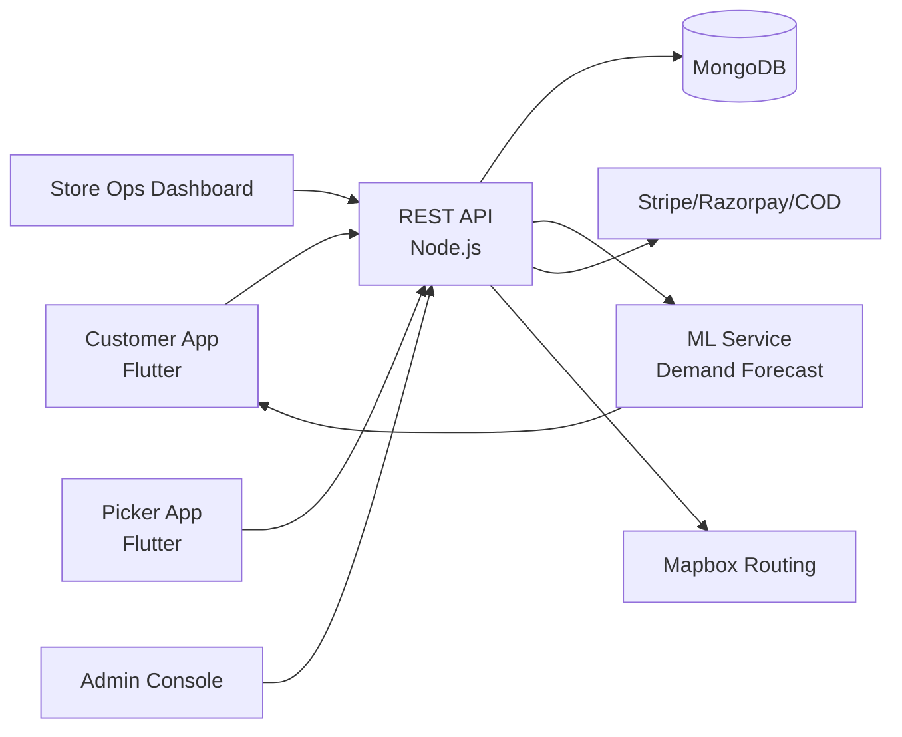

# Onecart Clone — White-Label Quick-Commerce Grocery Delivery Platform by Miracuves

**MXAzon** is a production-ready, white-label Onecart clone: a complete quick-commerce grocery platform with customer, store-ops, and picker apps — delivered with **100% source code ownership** in **6 working days**.

> 🛒 **See it running before you talk to anyone.** Live customer app, store ops console, picker app, and admin dashboard — demo credentials are printed on the [solution page](https://miracuves.com/onecart-clone#demo). No sales call required.

---

## 🚀 Live Demos

| Environment | URL | What you can test |
|---|---|---|
| 📱 Customer App (Android) | [mas.mimeld.com](https://mas.mimeld.com) | Search products, smart lists, scheduled delivery, live tracking |
| 🏪 Store Ops Dashboard | [Solution page → Demo](https://miracuves.com/onecart-clone#demo) | Inventory sync, SKU mgmt, promotions, picking routes |
| 📦 Picker App | [Solution page → Demo](https://miracuves.com/onecart-clone#demo) | Pick lists, store routing, batched fulfilment, instant pay |
| 🛠️ Admin Console | [Solution page → Demo](https://miracuves.com/onecart-clone#demo) | Dark stores, inventory, commissions, demand forecasting |

Demo credentials for all environments: **[miracuves.com/onecart-clone → Demo section](https://miracuves.com/onecart-clone/#demo)**

---

## ✨ What Makes This Onecart Clone Different

Most grocery-delivery scripts stop at "search + checkout." This platform ships with the features that actually run a quick-commerce *business*:

- **10-Minute Delivery Engine** — dark-store geo-fencing, picker-routing AI, and rider batching designed for the 10-minute promise Blinkit built on
- **Smart Substitution Engine** — when an item is out of stock, the system suggests the closest match (size, brand, price) and offers 1-tap customer approval
- **Multi-Tier Inventory** — warehouses → dark stores → micro-fulfilment → rider — single inventory model that tracks SKU location in real time
- **Expiry & Waste Reduction** — automatic markdown rules based on days-to-expiry, supplier returns workflow, and waste analytics by category
- **B2B & B2C Unified** — same platform serves household customers and HoReCa businesses with separate pricing, invoicing, and credit terms

## 📦 Core Features

**Customer:** search products · smart lists · scheduled delivery · live order tracking · substitutions handling · multi-payment · loyalty rewards · 10-min express delivery

**Store Manager:** inventory sync · SKU management · promotions · expiry tracking · dark-store ops · picking routes · supplier management

**Delivery Partner:** pick-list navigation · store-aware routing · batch deliveries · instant pay · performance metrics

**Admin:** dark-store network · dynamic inventory · category management · commission engine · demand forecasting · regional pricing

## 🏗️ Architecture

**Stack:** Flutter mobile apps · Node.js backend · MongoDB for product catalog · Redis for inventory locks · ML service for demand forecasting · Stripe, Razorpay, COD support

## 📋 What’s Included

- ✅ Full source code — backend, web, mobile apps, panels (no encryption, no license locks)
- ✅ Deployment to your servers & app store submission assistance
- ✅ Your branding — white-label rename, logo, colors, domain
- ✅ 60 days post-launch support + 12 months of free updates
- ✅ Documentation & handover

**Pricing:** from **$2,899**, transparent on the [solution page](https://miracuves.com/onecart-clone/#pricing) — no "contact us for quote" games.

## 🆚 Why Not Build From Scratch?

Custom quick-commerce platforms run $80k–$350k and 5–10 months. A proven white-label base gets you to market in 6 working days for a fraction of that, with your budget preserved for dark-store buildout and rider incentives.

## 📚 Resources

- 📖 [Onecart Clone — Full Solution Page](https://miracuves.com/onecart-clone) (features, pricing, demos, FAQ)
- 💰 [How Much Does a Grocery Delivery App Cost in 2026?](https://miracuves.com/onecart-clone#pricing) pricing breakdown & what's included
- 📝 [Best Onecart Clone Script in 2026](https://miracuves.com/onecart-clone/blog/) features, pricing & launch guide
- 🧠 [Why Dark Stores Beat Hyperlocal Warehouses](https://miracuves.com/onecart-clone/blog/) lessons from Blinkit & Zepto
- ✅ [Miracuves Facts & Claims Ledger](https://miracuves.com/onecart-clone/facts/) every claim we make, verified

## 🏢 About Miracuves

[Miracuves Solutions](https://miracuves.com) builds white-label clone apps and custom software from Mumbai, India — 90+ ready-made solutions, live demos for every product, transparent pricing, and delivery in 6 working days. Operating since 2010.

**Talk to us:** [WhatsApp](https://wa.me/919830009649) · [Schedule a consultation](https://miracuves.com/schedule-consultation/) · [miracuves.com](https://miracuves.com)

---

### ⚠️ Note on This Repository

This repository is a product overview. The full source code is delivered to clients on purchase — see [what’s included](https://miracuves.com/onecart-clone/#included). For a hands-on evaluation, use the live demos above; credentials are public on the solution page.

*Keywords: onecart clone, onecart clone script, grocery delivery app development, quick commerce, white label grocery, dark store, Flutter grocery app, Node.js grocery platform*

---

<!--
══════════════════════════════════════════════════
TEMPLATE VARIABLE KEY — auto-generated from Netflix-Clone pattern
══════════════════════════════════════════════════
{APP_NAME}        Onecart Clone
{MX_NAME}         MXAzon
{CATEGORY}        Quick-Commerce Grocery Delivery Platform
{DEMO_WEB}        mxazon.mimeld.com
{PRICE}           $2,899
{SLUG}            onecart-clone
{SOLUTION_URL}    https://miracuves.com/onecart-clone/
{VERTICAL}        grocery

See /tmp/verticals/grocery.txt for the vertical config used to generate this README.
══════════════════════════════════════════════════
-->